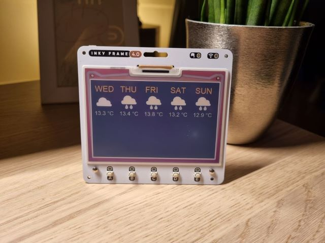
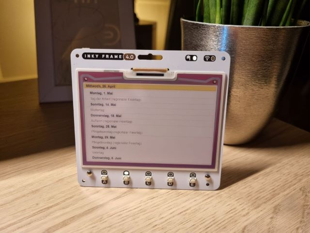

# InkyDashboard

InkyDashboard displays the most useful information for you in a simple to build eInk dashboard.

All heavy processing is happening in the cloud through GitHub Actions and your InkyFrame's only responsibility is to download the prepared dashboard images to display them. With the InkyDashboard being run on battery, this significantly increases the batteries life as it can go into deep sleep mode and only wake up when the displayed dashboard needs to be changed or refreshed.

This was a simple PoC to see if this approach is working in general and as it seems to do so, I publish it here on GitHub so that whoever likes this idea can build one for him or herself.

Available dashboards:

| Dashboard        | Photo                                                    |
| ---------------- | -------------------------------------------------------- |
| Weather forecast |    |
| Google calendar  |  |
| Joke of the day  |          |

The scripts would need some enhancements here and there to make it more robust and clean though. Such as:

* [ ]  Proper error handling on all fronts
* [ ]  Making it (more) easily expandable
* [ ]  More dashboards ...

**Feel free to change it and make it your own!**

## Hardware

This project only uses a Inky Frame 4.0 and and a battery pack.
https://shop.pimoroni.com/products/inky-frame-4

## Software

Since the RaspberryPi Pico W does not have much processing power and memory, the dashboard generation is being done in GitHub through GitHub Actions. You can find the Github Actions workflow under `.github/workflows`

The entire flow is as follows:

- GitHub Actions triggers the "main.py" script that does the following:
  - Retrieve the latest weather forecst for the upcoming five days
  - Take a screenshot of a public embedded Google Calendar
  - Retrieve the joke for the day
  - Retrieve anything you like, just extend the scripts ...  ;-)
  - Generate JPGs with the information retrieved by leveraging the Pillow library
  - Commit the generated images back to the repository into the "dashboards" folder
- The RaspberryPi Pico W will do the following:
  - Download the latest generated dashboards images every morning onto the SD card
  - Refresh the dashboard
  - Set the RTC (Real Time Clock) to next day for the next cycle of downloading the latest dashboards
  - Put the raspberry Pi Pico into deep sleep mode
  - If in the meantime any button is being pressed, the Raspberry Pi Pico W will wake up and display the associated dashboard

*When the InkyFrame is being run on battery, you can put it to sleep until you wake it up by either pressing a button or by setting the internal RTC to wake it up and automatically execute the main.py script. Due to this, the battery will be able to last you a very long time.*

### API's used

* Weather

  https://openweathermap.org/api
* Jokes

  https://jokes.one/api/joke/#python

# Setup

1. Clone the repository
2. Install Python dependencies `requirements.txt`
3. For local development, create a copy of `config/api_keys_local_template.py`, name it `config/api_keys_local.py` and enter your details
4. When running `main.py` it should automatically generate three dashboards in `dashboards`
5. For letting it run in GitHub through Actions, do following:
   1. Add the API keys with the same names as in the config/config.py and the Github Token (`GITHUB_TOKEN`) as secrets in your Github repository under `Settings --> Secrets and variables --> Actions`
   2. Add the GitHub Action with the workflow file from `.github/workflows/python-package-conda.yml`

For the Raspberry Pi to be able to download the dashboards, follow below steps:

1. Create a copy of `raspberrypi/WIFI_CONFIG_TEMPLATE.py`, name it `raspberrypi/WIFI_CONFIG.py` and enter your WIFI credentials
2. Edit raspberrypi/image_downloader.py and replace the variables `token (only in case of a private repository), owner, repo`
3. Copy contents of `raspberrypi` to your raspberry pi and power it on

*The InkyFrame only works properly when run via battery*

# Links

- "Add a Google calendar to your website" - The main.py script will to open the embed google calendar and take a screenshot of it
  https://support.google.com/calendar/answer/41207?hl=en
- Icons from:
  https://icons8.com/
- Picographics Library
  https://github.com/pimoroni/pimoroni-pico/tree/main/micropython/modules/picographics
